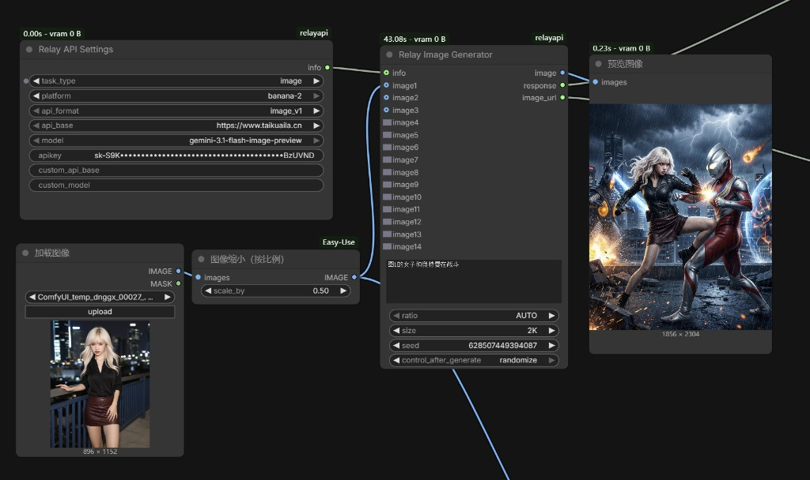
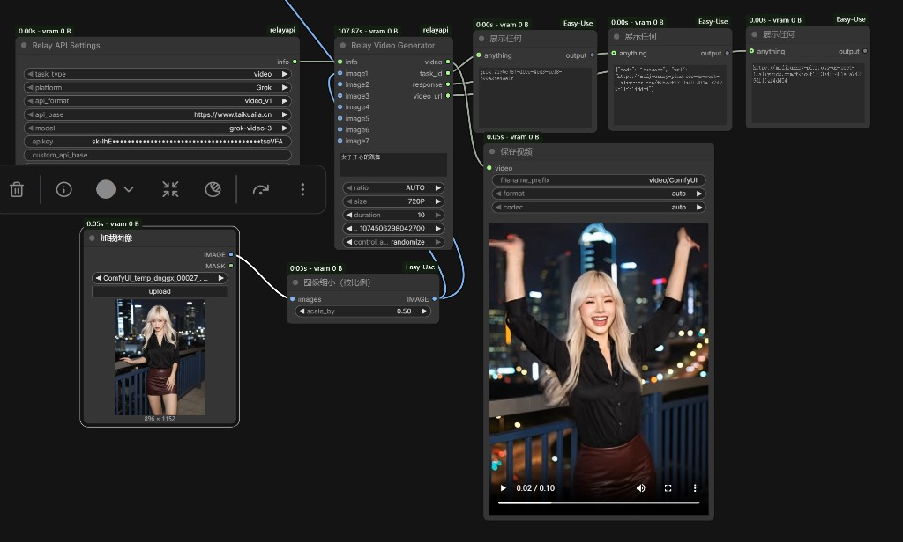

# ComfyUI-relayapi

ComfyUI 自定义节点包，用于通过中转站 API 调用文本、图像、视频和音乐生成服务。

## 节点

| 节点 | 用途 |
| --- | --- |
| Relay API Settings | 统一配置任务类型、平台、API 格式、中转站地址、模型和密钥 |
| Relay Text Generator | 文本生成和多图视觉理解 |
| Relay Image Generator | 文生图和图像编辑 |
| Relay Video Generator | Grok / Veo 视频生成 |
| Relay Sound Generator | Suno 音乐生成 |

## 安装

放到 ComfyUI 的 `custom_nodes` 目录：

```text
ComfyUI/custom_nodes/ComfyUI-relayapi/
```

重启 ComfyUI 后，在 `RelayAPI` 分类下使用节点。

## Relay API Settings

Settings 节点通过 `info` 输出把配置传给下游生成节点。

| 参数 | 说明 |
| --- | --- |
| `task_type` | `image` / `video` / `sound` / `text` |
| `platform` | 随任务类型切换 |
| `api_format` | 使用端点路径命名，随任务类型和平台切换 |
| `api_base` | 中转站地址 |
| `model` | 当前平台和格式可用的模型 |
| `apikey` | API Key，本地保存并在界面遮盖显示 |
| `custom_api_base` | 输入新地址添加；输入 `delete:地址` 删除 |
| `custom_model` | 输入新模型添加；输入 `delete:模型名` 删除 |

内置地址：

```text
https://www.taikuaila.cn
https://ai.t8star.cn
https://api.bltcy.ai
```

注意：API Key 要和 `api_base` 对应。

## API 格式

`api_format` 现在直接用端点路径命名，避免把中转站接口误解成官方原生格式。

| 任务 | 格式 |
| --- | --- |
| image | `v1beta/models` / `v1/images` / `v1/chat/completions` |
| video | `v1/video` / `v1/videos` / `v2/videos` |
| sound | `suno/submit` |
| text | `v1beta/models` / `v1/chat/completions` |

端点名只决定 URL；具体 payload 仍由对应的生成节点按文本、图像、视频、音乐任务分别拼装。

## 文本

平台：

| platform | api_format | 模型 |
| --- | --- | --- |
| GeminiText | `v1beta/models` | `gemini-3.1-flash-lite-preview` / `gemini-3-flash-preview` / `gemini-3.1-pro-preview` |
| GeminiText | `v1/chat/completions` | `gemini-3.1-flash-lite-preview` / `gemini-3-flash-preview` / `gemini-3.1-pro-preview` |
| OpenaiText | `v1/chat/completions` | `claude-opus-4-6` / `grok-4.1`，以及用户自定义模型 |

`OpenaiText` 只允许 `v1/chat/completions`。

输入：

| 参数 | 说明 |
| --- | --- |
| `prompt` | 文本提示词 |
| `image1` ~ `image8` | 可选图片输入 |
| `seed` | 只用于 ComfyUI 重跑控制，不会传给 API |

输出：

| 输出 | 说明 |
| --- | --- |
| `text` | 提取后的纯文本结果 |
| `response` | 精简 JSON，只保留 `code`、`text`、`platform`、`api_format`、`model`、耗时、用量等字段 |

`response` 不输出 Gemini 原始 `candidates` 和 `thoughtSignature`，避免展示节点被长串内容卡住。

## 图像

平台和模型：

| platform | api_format | 模型 |
| --- | --- | --- |
| banana-pro | `v1beta/models` | `gemini-3-pro-image-preview` |
| banana-pro | `v1/images` | `nano-banana-pro` |
| banana-pro | `v1/chat/completions` | `gemini-3-pro-image-preview` |
| banana-2 | `v1beta/models` | `gemini-3.1-flash-image-preview` |
| banana-2 | `v1/chat/completions` | `gemini-3.1-flash-image-preview` |
| gpt-image2 | `v1/images` | `gpt-image-2` |

图像接口：

| api_format | 端点 |
| --- | --- |
| `v1beta/models` | `/v1beta/models/{model}:generateContent` |
| `v1/images` | `/v1/images/generations` 或 `/v1/images/edits` |
| `v1/chat/completions` | `/v1/chat/completions` |

输入：

| 参数 | 说明 |
| --- | --- |
| `prompt` | 文生图提示词或编辑指令 |
| `ratio` | 画面比例 |
| `size` | `1K` / `2K` / `4K` |
| `image1` ~ `image16` | 可选参考图或编辑图 |
| `quality` / `moderation` | 主要用于 `gpt-image2` |
| `seed` | 只用于 ComfyUI 重跑控制，不会传给 API |

格式说明：

| api_format | 行为 |
| --- | --- |
| `v1beta/models` | 使用 Gemini `generationConfig.imageConfig`，结构化传入 `ratio` 和 `size` |
| `v1/images` | 使用图像接口字段；`gpt-image2` 会把 `ratio` + `size` 换算成具体像素尺寸，例如 `2K` + `1:1` 发送为 `2048x2048` |
| `v1/chat/completions` | 不稳定识别结构化 `size` 字段；节点不会传 `size` 和 `seed`，当 `ratio` 不是 `auto` 时，会把比例要求自动拼进提示词 |

`v1/chat/completions` 自动拼接示例：

```text
请生成宽高比为 21:9 的图片，严格保持这个画面比例。
```

输出：

| 输出 | 说明 |
| --- | --- |
| `image` | 生成图片 |
| `response` | 精简结果 JSON，大段 base64 会被省略 |
| `image_url` | 图片 URL，若接口返回 |



## 视频

平台：

| platform | 说明 |
| --- | --- |
| Grok | Grok 视频 |
| Veo | Veo 视频 |

格式区别：

| api_format | 主要用途 | 创建 | 查询 |
| --- | --- | --- | --- |
| `v1/video` | V1 视频接口 | `/v1/video/create` | `/v1/video/query?id={task_id}` |
| `v1/videos` | OpenAI 视频格式 V1 接口 | `/v1/videos` | `/v1/videos/{task_id}` |
| `v2/videos` | BLT/柏拉图一类 V2 接口 | `/v2/videos/generations` | `/v2/videos/generations/{task_id}` |

`v1/videos` 如查询完成但没有直接返回视频 URL，会继续尝试：

```text
/v1/videos/{task_id}/content
```

模型：

| platform | api_format | 模型 |
| --- | --- | --- |
| Grok | `v1/video` / `v1/videos` / `v2/videos` | `grok-video-3` / `grok-videos` |
| Veo | `v1/video` / `v1/videos` / `v2/videos` | `veo3.1` / `veo3.1-fast` / `veo_3_1-lite` / `veo_3_1-lite-4K` / `veo_3_1-fast-4K` |

Grok 参数：

| 参数 | 支持值 |
| --- | --- |
| `size` | `720P` / `1080P` |
| `duration` | `6` / `10` / `15` / `30` |
| `ratio` | `auto` / `16:9` / `9:16` / `1:1` / `4:3` / `3:4` / `3:2` / `2:3` |

Veo 参数：

| 参数 | 支持值 |
| --- | --- |
| `size` | `720P` / `1080P`。4K 由 `*-4K` 模型名决定，不再作为 `size=4K` 传入 |
| `duration` | `4` / `6` / `8` |
| `ratio` | `16:9` / `9:16` |
| `enhance_prompt` | `true` / `false` |
| `enable_HD` | `true` / `false` |

输出：

| 输出 | 说明 |
| --- | --- |
| `video` | 下载到本地临时目录后加载的视频 |
| `task_id` | 任务 ID |
| `response` | 精简结果 JSON，包含 URL、平台、格式和脱敏后的请求 payload |
| `video_url` | 视频 URL |

视频 `response` 中的图片 base64 会被省略成长度提示，避免展示节点卡死。



## 声音

Suno 现在只保留一个格式：

```text
suno/submit
```

端点：

```text
POST /suno/submit/music
GET  /suno/fetch/{task_id}
```

版本映射：

| 版本 | mv |
| --- | --- |
| V3 | `chirp-v3.0` |
| V3.5 | `chirp-v3.5` |
| V4 | `chirp-v4` |
| V4.5 | `chirp-auk` |
| V4.5+ | `chirp-bluejay` |
| V5 | `chirp-crow` |
| V5.5 | `chirp-fenix` |

输入：

| 参数 | 说明 |
| --- | --- |
| `generation_mode` | 描述模式或歌词定制模式 |
| `title` / `tags` / `prompt` | 歌曲标题、风格和提示词 |
| `make_instrumental` | 是否纯音乐 |
| `negative_tags` | 不想要的风格 |
| `continue_clip_id` / `continue_at` | 续写参数 |
| `seed` | 只用于 ComfyUI 重跑控制，不会传给 API |

Suno 接口可能一次返回两首歌。当前节点的 `audio` 输出只取一个最佳 clip；完整列表仍在 `response.query` 里。

## 错误处理

节点失败时，`response` 输出：

```json
{"code": "error", "message": "错误详情"}
```

如果接口返回空内容或非 JSON，视频节点会显示具体接口、HTTP 状态码和返回内容片段，方便判断是 key、base_url、端点还是服务端问题。

常见问题：

| 现象 | 原因 |
| --- | --- |
| `Expecting value: line 1 column 1` | 接口返回空内容或非 JSON。通常是 `api_base` 和 key 混用，或端点不匹配 |
| `PUBLIC_ERROR_UNSAFE_GENERATION` | 视频生成被安全过滤 |
| Grok 选择 1080P 但结果仍为 720 | 请求已传 `resolution: 1080p`，若结果仍低分辨率，通常是中转站或模型通道忽略该档位 |
| `当前分组上游负载已饱和` | 中转站当前分组上游拥堵，换 key/分组或稍后重试 |

## 配置文件

本地配置保存到：

```text
relay_config.json
```

保存内容包括：

- 自定义中转站地址
- 自定义模型
- 节点级 API Key 和 base_url

不要把含真实 API Key 的 `relay_config.json` 提交到公开仓库。

## License

[MIT License](LICENSE)
